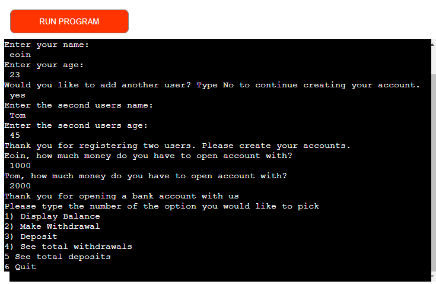
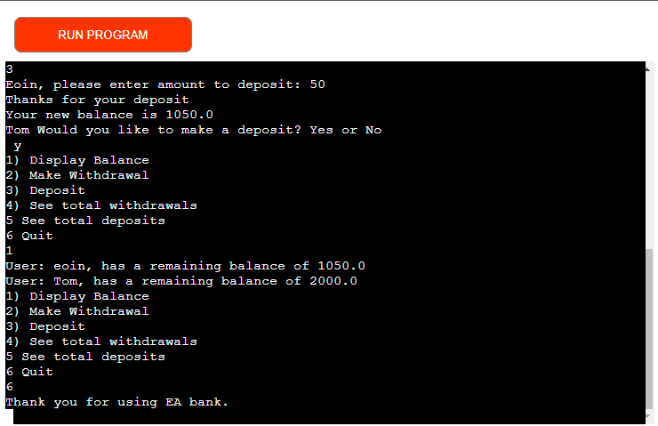
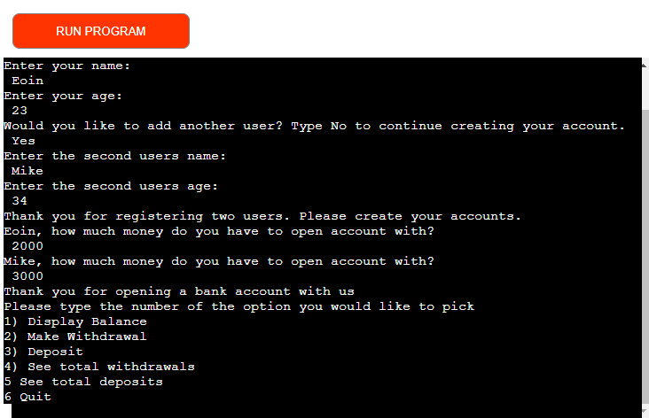
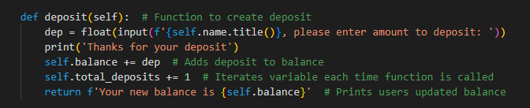

# Banking App  
 
The purpose of this app is to allow users to set up a bank account. The account will have optional features such as deposit, withdraw and display balance.  

[The link to the deployed app can be found here](https://eoins-atm.herokuapp.com/)

## How to use

- Once started the user will be asked to input their name and age to the terminal.

 - The user then has an option to add a second user account.
 - Upon entering personal user information the users will be asked to input an amount to open account with
 - The user is then met with a list of options which they can choose from
 - Each chosen option will lead to the user being asked to input information and it will return the updated users bank information
 - Once the user is finished with their transactions, they have the option to quit which closes the program and leaves a message

## Features
 - The app allows a user to set up another account for a second user when it begins.  
 

 - The app has deposit and withdrawal features, as well as a log for total withdrawals and deposits
  
----
## Future Features
- An option to open either a current or savings account with different options available in each menu.

----
## Technologies Used
- Python
- Heroku
----
## Testing
- I tested my code in the python terminal and commited my code after building each new class or functions, as well as after debugging and deployment
- I deployed my site and used the terminal on Heroku to manually enter data and see how it responded
- I asked my family and a couple of friends to try out the app and see if there was any issues foe them. It seemed to function without error or crashing    

----
## Accessibility
- I did not address accessibility with this project as it was made for a Command Line Interface.
- I did not use any HTML, CSS or use any images on this site

----
## Bugs & Issues  
- Unresolved Issue      
The deployment terminal is set to 80 columns by 24 row. My code often exceeds 80 columns. This however does not effect the programs ability to run, as the output to the Heroku terminal never exceed 80 columns. These errors only appear on lines where there are comments. If i put the comments on the line below or above each time the code would be very difficult to read. 

----
## Validator Testing
- Validation testing was done with [Pep 8 Online](http://pep8online.com/)
----
## Deployment
- I had some trouble with initial deployment attempts on this project. I had accidentaly deleted my packages.json folder when i started as i did not know it was needed when deploying a project that contains just a Python file. After some troubleshooting with excellent tutor support, I resolved the issue and the site deployed without any problems.   

----
## Credits

- Help with the concept of using Parent and Child classes to create a bank app [Bank Classes](https://youtu.be/xTh-ln2XhgU)   
- Thanks to Tutor support for all the help deploying to Heroku 
